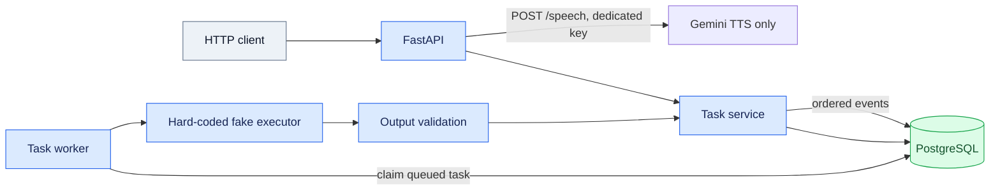
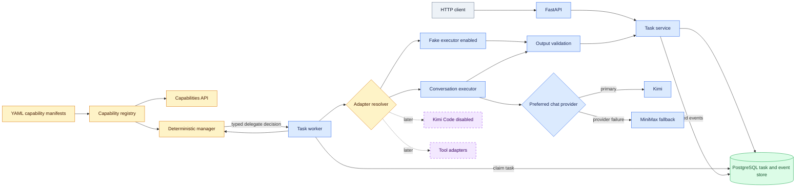

# Architecture

## Previous foundation

The task lifecycle is reliable, but executor selection is embedded directly in
the worker. Adding Kimi, a model, or a tool would require editing worker logic.

## Current architecture

This capability-driven layer is now implemented. The manager returns only
schema-validated actions. Application code still owns state transitions,
adapter availability, cancellation, and validation. The conversation executor uses
Kimi and MiniMax through one provider-neutral, preference-ordered fallback contract.
The manager-model boundary uses the same failure-only provider-chain policy. Kimi Code remains a
separate disabled future capability and cannot be selected until its adapter is built
and the manifest is explicitly enabled.

Gemini is isolated from both model-selection paths. Only the API process receives
`GEMINI_TTS_API_KEY`; `POST /speech` converts Gemini's raw 24 kHz PCM to WAV and keeps a
bounded repeat-request cache. The Android client falls back to local TTS whenever this
optional endpoint is unavailable.

## Manager-model boundary

```mermaid
flowchart LR
    task[Task without explicit requirements] --> assisted[Model-assisted manager]
    assisted --> adapter[Validated manager-model adapter]
    adapter --> prompt[Prompt plus capability catalog and JSON schema]
    prompt --> client{Provider client}
    client --> scripted[Scripted test client]
    client --> kimi[Kimi manager client opt-in]
    client --> minimax[MiniMax manager client opt-in]
    scripted --> raw[Raw JSON response]
    kimi --> raw
    minimax --> raw
    raw --> guard[Schema and capability allowlist validation]
    guard --> analysis[TaskAnalysis]
    analysis --> policy[Deterministic routing policy]
    policy --> registry[Capability registry]
    registry --> decision[Typed manager outcome]

    explicit[Task with explicit requirements] --> policy

    classDef implemented fill:#dbeafe,stroke:#2563eb,color:#172554
    class task,assisted,adapter,prompt,client,scripted,kimi,minimax,raw,guard,analysis,policy,registry,decision,explicit implemented
```

The model only infers `TaskAnalysis`; it never chooses an adapter or command.
Explicit requirements bypass inference. Malformed or invented outputs receive
one schema-repair attempt and then become a safe, audited failure. Kimi and
MiniMax provider clients are implemented but model analysis remains disabled unless
`ASSISTANT_MANAGER_MODEL_ENABLED=true`; deterministic routing is the default.
