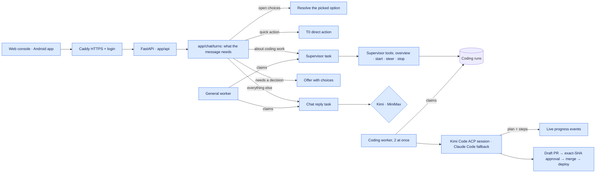

# Architecture

For the target model (work items, disposable chats, tiered agents) see
[`assistant-core-model.md`](assistant-core-model.md).

## How a message is handled

The full picture, with what is built, partial, and next, is
[`personal-assistant-target-architecture.svg`](personal-assistant-target-architecture.svg).
This is the request path in the code today.

```mermaid
flowchart LR
    client[Web console · Android app] --> caddy[Caddy HTTPS + login]
    caddy --> api[FastAPI · app/api]
    api --> turns[app/chat/turns: what the message needs]
    turns -->|open choices| choice[Resolve the picked option]
    turns -->|quick action| t0[T0 direct action]
    turns -->|about coding work| sup[Supervisor task]
    turns -->|needs a decision| offer[Offer with choices]
    turns -->|everything else| chat[Chat reply task]

    worker[General worker] -->|claims| sup
    worker -->|claims| chat
    sup --> tools[Supervisor tools: overview · start · steer · stop]
    tools --> runs[(Coding runs)]
    chat --> llm{Kimi · MiniMax}

    coding[Coding worker, 2 at once] -->|claims| runs
    coding --> session[Kimi Code ACP session · Claude Code fallback]
    session -->|plan + steps| progress[Live progress events]
    session --> pr[Draft PR → exact-SHA approval → merge → deploy]

    classDef current fill:#dbeafe,stroke:#2563eb,color:#172554
    class client,caddy,api,turns,choice,t0,sup,offer,chat,worker,tools,llm,coding,session,progress,pr current
```

- **Triage** decides per message, with a fast model checked by rules. Small talk gets a
  chat reply, bookkeeping is done instantly (T0), and anything about coding work goes to
  the **supervisor**.
- **The supervisor** sees every run (state, the agent's plan and latest step, PR) and acts
  through tools. It can start a coding agent, message a running one (a new turn in the
  same session) or stop it. No tool can merge or deploy; those stay behind the approval
  token in the console.
- **Replies carry blocks.** These are choices, links, workflow and work-item cards,
  rendered by pre-built console components. A choice is answered by clicking it or by
  saying "yes" or "no".
- **Coding agents** run as live sessions (Kimi Code over ACP), so their plan and steps
  stream back as progress, and new instructions reach them while they work.

## Code map

| Package | What lives there |
|---|---|
| `app/api` | One router per resource (chat, tasks, workflows, catalog, web, …) and shared helpers |
| `app/chat` | Message handling: triage, offers, choices and other blocks, quick actions |
| `app/assistant` | The supervisor and its overview of the work |
| `app/coding` | Starting runs, the agents (runners, ACP sessions, one-shot processes), git, reports, the PR executor |
| `app/services` | `TaskService`: chat, tasks, executions, approvals and progress over one database |
| `app/work` | Work items, briefs, spaces, memory |
| `app/execution` | The chat model and research agent executors |
| `app/workflows`, `app/deployments` | Controlled workflows and deployment targets |
| `app/web` | The console: `index.html` plus `static/` CSS and scripts, PWA files |
| `android-assistant/shell` | The Android app: the console in a native shell |

## Rules that hold everywhere

The manager returns only schema-validated actions. Application code owns state
transitions, adapter availability, cancellation and validation. Chat models are used
through one provider-neutral fallback chain: Kimi and MiniMax.

Gemini is used only for text-to-speech, and only the API process receives
`GEMINI_TTS_API_KEY`.

The coding workflow is a registered agent capability, while merging is deliberately
outside routing.
- **How coding starts:** coding tasks are created only by a coding run, which you start
  in chat or the supervisor starts, or by a PR revision. The public task routes refuse
  coding capabilities.
- **What a coding task does:** it works on its own branch, publishes a draft PR, and
  waits for approval.
- **Merging:** the approval API binds consent to the recorded PR and its exact head SHA
  before calling GitHub. GitHub branch protections remain an independent final gate.

## Manager-model boundary

```mermaid
flowchart LR
    task[Task without explicit requirements] --> assisted[Model-assisted manager]
    assisted --> adapter[Validated manager-model adapter]
    adapter --> prompt[Prompt plus capability catalog and JSON schema]
    prompt --> client{Provider client}
    client --> scripted[Scripted test client]
    client --> kimi[Kimi manager client opt-in]
    client --> minimax[MiniMax manager client opt-in]
    scripted --> raw[Raw JSON response]
    kimi --> raw
    minimax --> raw
    raw --> guard[Schema and capability allowlist validation]
    guard --> analysis[TaskAnalysis]
    analysis --> policy[Deterministic routing policy]
    policy --> registry[Capability registry]
    registry --> decision[Typed manager outcome]

    explicit[Task with explicit requirements] --> policy

    classDef implemented fill:#dbeafe,stroke:#2563eb,color:#172554
    class task,assisted,adapter,prompt,client,scripted,kimi,minimax,raw,guard,analysis,policy,registry,decision,explicit implemented
```

The model only infers `TaskAnalysis`; it never chooses an adapter or command.
Explicit requirements bypass inference. Malformed or invented outputs receive
one schema-repair attempt and then become a safe, audited failure. Kimi and
MiniMax provider clients are implemented but model analysis remains disabled unless
`ASSISTANT_MANAGER_MODEL_ENABLED=true`; deterministic routing is the default.
