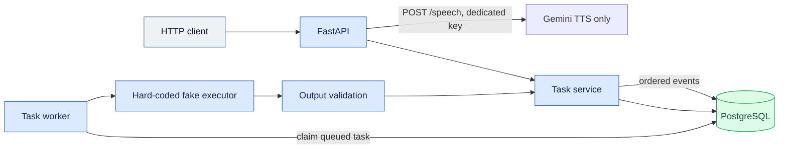

# Architecture

For the target model (work items, disposable chats, tiered agents) see
[`assistant-core-model.md`](assistant-core-model.md).

## Previous foundation

```mermaid
flowchart LR
    client[HTTP client] --> api[FastAPI]
    api --> service[Task service]
    api -->|POST /speech, dedicated key| gemini[Gemini TTS only]
    service --> db[(PostgreSQL)]
    worker[Task worker] -->|claim queued task| db
    worker --> fake[Hard-coded fake executor]
    fake --> validation[Output validation]
    validation --> service
    service -->|ordered events| db

    classDef boundary fill:#edf2f7,stroke:#64748b,color:#0f172a
    classDef runtime fill:#dbeafe,stroke:#2563eb,color:#172554
    classDef persistence fill:#dcfce7,stroke:#16a34a,color:#14532d
    class client boundary
    class api,service,worker,fake,validation runtime
    class db persistence
```

The task lifecycle is reliable, but executor selection is embedded directly in
the worker. Adding Kimi, a model, or a tool would require editing worker logic.

## Current architecture

The full picture, with what is built, partial, and next, is
[`personal-assistant-target-architecture.svg`](personal-assistant-target-architecture.svg).
This diagram is the request path in the code today.

```mermaid
flowchart LR
    client[Web console / Android] --> caddy[Caddy HTTPS + login]
    caddy --> api[FastAPI]
    api --> service[Task service]
    api --> items[Work item service]
    service --> db[(PostgreSQL: tasks, events, chats, work items)]
    items --> db

    manifests[YAML manifests] --> registry[Capability registry]
    registry --> manager[Deterministic manager]

    worker[Task worker] -->|claim task| db
    worker --> manager
    manager -->|typed delegate decision| worker
    worker --> conversation[Conversation executor]
    conversation --> chat{Chat provider}
    chat -->|primary| kimichat[Kimi]
    chat -->|provider failure| minimaxchat[MiniMax]
    worker -.->|idle thread| writeback[Brief write-back]
    writeback --> chat

    api --> workflows[Coding workflow: propose → approve → start]
    workflows --> codingworker[Coding worker container]
    codingworker --> worktree[Isolated Git worktree]
    worktree --> runners[Kimi Code → Claude Code + MiniMax]
    runners --> repair[Validate · one repair pass]
    repair --> pr[Draft GitHub pull request]
    pr --> approval[Exact-SHA human approval]
    approval --> merge[GitHub merge API]
    merge --> deploy[Approved deployment]
    deploy --> deployer[Host deployer → redeploy + rollback]

    classDef current fill:#dbeafe,stroke:#2563eb,color:#172554
    classDef persistence fill:#dcfce7,stroke:#16a34a,color:#14532d
    class client,caddy,api,service,items,manifests,registry,manager,worker,conversation,chat,kimichat,minimaxchat,writeback,workflows,codingworker,worktree,runners,repair,pr,approval,merge,deploy,deployer current
    class db persistence
```

This capability-driven layer is now implemented. The manager returns only
schema-validated actions. Application code still owns state transitions,
adapter availability, cancellation, and validation. The conversation executor uses
Kimi and MiniMax through one provider-neutral, preference-ordered fallback contract.
The manager-model boundary uses the same failure-only provider-chain policy.

Gemini is isolated from both model-selection paths. Only the API process receives
`GEMINI_TTS_API_KEY`; `POST /speech` converts Gemini's raw 24 kHz PCM to WAV and keeps a
bounded repeat-request cache. The Android client falls back to local TTS whenever this
optional endpoint is unavailable.

The coding workflow is a registered agent capability, while merge is deliberately
outside manager routing. Coding tasks are only created by an approved coding workflow or
a PR revision; the public task routes refuse coding capabilities. A code task publishes a
draft PR and enters `waiting_for_approval`. The approval API binds consent to the recorded PR and its exact
head SHA before invoking GitHub. GitHub branch protections remain an independent final
gate.

## Manager-model boundary

```mermaid
flowchart LR
    task[Task without explicit requirements] --> assisted[Model-assisted manager]
    assisted --> adapter[Validated manager-model adapter]
    adapter --> prompt[Prompt plus capability catalog and JSON schema]
    prompt --> client{Provider client}
    client --> scripted[Scripted test client]
    client --> kimi[Kimi manager client opt-in]
    client --> minimax[MiniMax manager client opt-in]
    scripted --> raw[Raw JSON response]
    kimi --> raw
    minimax --> raw
    raw --> guard[Schema and capability allowlist validation]
    guard --> analysis[TaskAnalysis]
    analysis --> policy[Deterministic routing policy]
    policy --> registry[Capability registry]
    registry --> decision[Typed manager outcome]

    explicit[Task with explicit requirements] --> policy

    classDef implemented fill:#dbeafe,stroke:#2563eb,color:#172554
    class task,assisted,adapter,prompt,client,scripted,kimi,minimax,raw,guard,analysis,policy,registry,decision,explicit implemented
```

The model only infers `TaskAnalysis`; it never chooses an adapter or command.
Explicit requirements bypass inference. Malformed or invented outputs receive
one schema-repair attempt and then become a safe, audited failure. Kimi and
MiniMax provider clients are implemented but model analysis remains disabled unless
`ASSISTANT_MANAGER_MODEL_ENABLED=true`; deterministic routing is the default.
