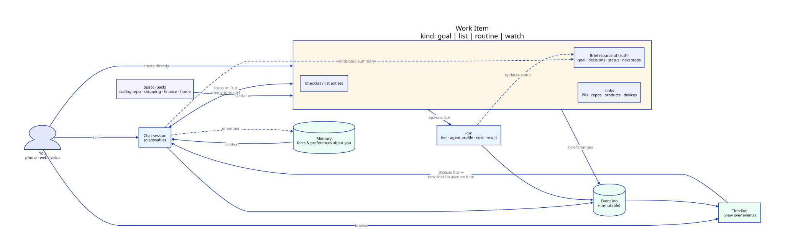
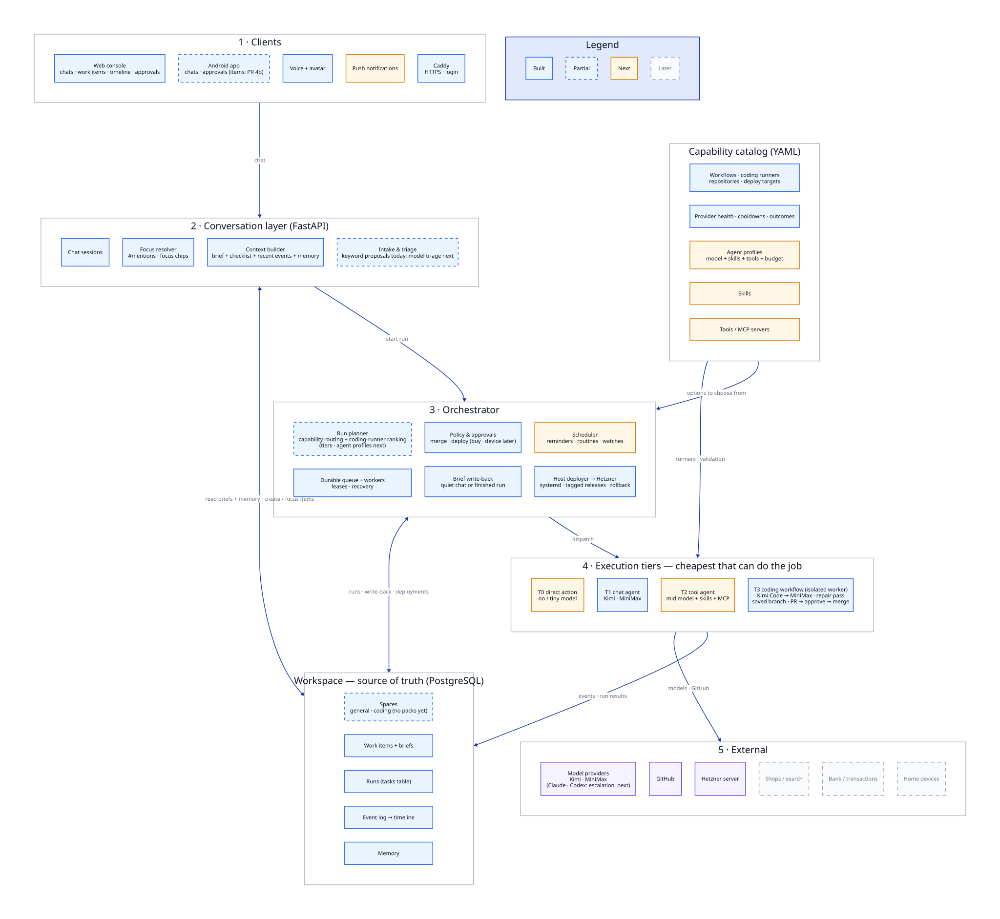

# Assistant Core Model

The assistant is growing from a coding task runner into a general personal
assistant: coding first, later shopping, finances, and home devices. This document
defines the core concepts that let chats and tasks interleave freely, and the tiered
orchestration that routes each piece of work to the cheapest capable agent.

- Concept model: [`assistant-core-model.svg`](assistant-core-model.svg)
  (source: [`assistant-core-model.d2`](assistant-core-model.d2))
- Target architecture: [`personal-assistant-target-architecture.svg`](personal-assistant-target-architecture.svg)
  (source: [`personal-assistant-target-architecture.d2`](personal-assistant-target-architecture.d2))

## The gap today

A `tasks` row (`migrations/001_initial.sql`) is really one execution. A task belongs
to at most one chat (`tasks.chat_session_id`, `003`), and continuing work creates a
new row linked through `parent_task_id` / `superseded_by_task_id` (`005`, `012`).
Nothing durable represents "the feature I am building", so a later chat has nothing
to attach to.

## Concepts

| Concept | What it is | Lifetime |
|---|---|---|
| **Space** | A domain such as a coding repository, Shopping, Finance, or Home. Bundles its tools/MCP servers, skills, workflows, and agent profiles as a *pack*. | Permanent |
| **Work item** | A durable goal. `kind` is `goal`, `list`, `routine`, or `watch`. Holds a **brief** (goal, decisions, status, next steps), a checklist or list entries, and links (PRs, products, devices). The brief is the source of truth. | Until done or archived |
| **Chat** | A conversation focused on zero or more work items (many-to-many). Disposable: its useful content is written back into briefs. | Short |
| **Run** | One agent execution for a work item, with a tier, agent profile, cost, and result. Today's `tasks` row. | Minutes to hours |
| **Event** | An immutable fact: message, decision, run step, approval, PR opened. Linked to a work item and/or a chat. | Forever |
| **Timeline** | A view over events, not a separate store. "Discuss" on any event opens a new chat focused on that event's work item. | — |
| **Memory** | Facts about the user, not about a task: preferences, sizes, budget, infrastructure. Global or per Space. | Permanent |

### Rules

1. **Chat to work item.** "Make this a task" creates a work item with a brief drafted
   from the chat and focuses the chat on it. Work items can also be created directly.
2. **Resuming.** A new chat that mentions or picks a work item loads its brief, recent
   events, and relevant memory, not old transcripts. Nothing is redone.
3. **Write-back.** When a chat goes idle or a run finishes, a cheap model updates the
   brief. Every brief change is also an event, so its history is auditable.
4. **One shape for personal work.** A shopping list is a `list` item in the Shopping
   Space; "find a good rain jacket" is a `goal` that spawns a research run; "review my
   spending monthly" is a `routine` triggered by the scheduler.

## Tiered orchestration

A cheap model triages each request; deterministic policy then picks the cheapest tier
that can do the job. This keeps the existing boundary in
`app/manager/model_assisted.py`: the model only analyzes, policy decides.

| Tier | Executor | Examples |
|---|---|---|
| T0 | Direct action, no or tiny model | Add to list, save memory, set reminder |
| T1 | Chat agent, small model, read-only tools | Answer, summarize, draft a brief |
| T2 | Tool agent, mid model with skills and MCP tools | Product research, transaction analysis |
| T3 | YAML workflow with a strong runner | Coding: worktree → runner → validate → draft PR → approval → merge → deploy |

An **agent profile** is model + skills + tools + permissions + budget, declared in a
Space pack next to the existing manifests. **Policy and approvals** gate every side
effect (merge, deploy, purchase, device action) and push approval requests to the phone.

## Mapping to today's code

| Concept | Existing code | Change | Status |
|---|---|---|---|
| Work item, Space | `work_items`, `spaces` (`013`), `app/work_items.py` | New | Done (#20); Spaces are `general` and `coding`, no packs yet |
| Run | `tasks`, `executions`, `app/service.py`, `app/worker.py` | Add `work_item_id`; keep lifecycle, leases, recovery | Done (#20) |
| Event / timeline | `task_events` + `work_item_events` | Timeline merges item events with whitelisted run events | Done (#20) |
| Chat | `chat_sessions`, `chat_messages`, `chat_work_items` | Chats focus on items, by #mention or chips | Done (#20, #21, #22) |
| Brief | `work_items.brief`, `app/briefs.py` | In model prompts; rewritten after quiet chats and finished runs | Done (#21) |
| Memory | `memories` (`009`), `app/memory.py` | Add Space scope | Next |
| Run planner | `app/manager/`, `app/decision/coding.py` | Add tier to the decision | Next |
| Workflows (T3) | `workflows/*.yaml`, `app/workflows/` | Repair pass, saved branch, approved host deploys | Done (#9, #18) |
| Catalog | `capabilities/`, `coding-runners/`, `repositories/`, `app/capabilities/registry.py` | Load per Space pack; add agent profiles, skills, MCP tools | Next |
| Runtime state | `provider_runtime_states` (`008`, `010`), `app/providers/state.py` | Unchanged | Done |
| Approvals | Exact-SHA merge and deploy approval | Generalize to other side effects | Partial |

## Migration path

The detailed, phased plan (including deploying directly on the Hetzner server) is in
[`implementation-plan.md`](implementation-plan.md).

1. Add `spaces`, `work_items` (kind, brief, checklist, links), `chat_work_items`, and
   `tasks.work_item_id`. Backfill one work item per root task lineage.
2. Context builder loads brief + recent events + memory for focused items.
3. Brief write-back job on chat idle and run completion.
4. Android Task Center shows work items and a timeline with "Discuss".
5. Space pack loader wrapping the existing registries; add agent profiles.
6. Tier field in the decision engine; T0 direct actions and T2 tool agent with MCP.
7. Scheduler for reminders, routines, and watches; push notifications for approvals.
