# Coding Agent and GitHub Pull Request Workflow

## Safety model

The coding agent, GitHub publication, and merge are separate trust boundaries:

```mermaid
flowchart LR
    task[Task requiring coding + pull_request_creation] --> manager[Manager]
    manager --> capability[coding-pull-request capability]
    capability --> fetch[Fetch configured base branch]
    fetch --> worktree[Isolated Git worktree + assistant/task branch]
    worktree --> codex[Codex CLI, workspace-write sandbox]
    codex --> commit[Host validates diff and commits]
    commit --> push[Push dedicated branch]
    push --> draft[Create draft GitHub PR]
    draft --> wait[Task waits for approval]
    wait --> review[Human review + mark ready]
    review --> sha[Approve exact head SHA]
    sha --> merge[GitHub merge API]
    merge --> complete[Complete task + audit events]
```



- Repository path, GitHub repository, base branch, and remote are operator configuration;
  task input cannot redirect the agent to another repository.
- Codex receives only a reduced environment and runs non-interactively with an ephemeral
  session and `workspace-write` sandbox. It cannot commit, push, create a PR, or merge;
  the trusted host owns those operations.
- The worktree starts from a freshly fetched remote base branch. The original checkout is
  not modified.
- The host rejects an empty change and runs `git diff --check` before committing.
- A new `assistant/task-<id>` branch is pushed and a draft PR is created. The task moves to
  `waiting_for_approval`.
- Merge is not registered as a manager-selectable capability. It is available only through
  the explicit approval API, and only for the PR recorded by the execution.
- Approval must include the exact reviewed head SHA. If the branch changes, the gate is
  refreshed and a new approval is required.
- Draft or closed PRs are refused. GitHub branch protection, required reviews, and status
  checks remain authoritative and can reject the merge.
- `.github/workflows/ci.yml` runs lint, all backend tests, and Compose validation on each
  pull request. Configure that `backend` job as a required status check on the base branch.

## Configuration

Run the coding worker on a machine that has the configured repository, Git, Codex CLI,
Codex authentication, and Git push credentials:

```shell
export ASSISTANT_CODE_AGENT_ENABLED=true
export ASSISTANT_CODE_REPOSITORY_PATH=/absolute/path/to/repository
export ASSISTANT_CODE_WORKTREE_ROOT=/absolute/path/to/temporary-worktrees
export ASSISTANT_GITHUB_REPOSITORY=owner/repository
export ASSISTANT_GITHUB_TOKEN=github-token
export ASSISTANT_APPROVAL_TOKEN=separate-long-random-secret
export ASSISTANT_GITHUB_BASE_BRANCH=main
uv run python -m app.worker
```

Codex CLI authentication is independent from `ASSISTANT_GITHUB_TOKEN`. The agent reuses
the CLI's saved authentication, while the GitHub token is used only by trusted host code.
For a personal installation, use a fine-grained token scoped to the configured repository.
It needs **Pull requests: write** to create PRs and **Contents: write** to merge; Git push
also needs write access through the repository's configured Git credentials. For a shared
or production deployment, prefer a narrowly scoped GitHub App installation token.

The Compose worker does not bundle Codex or mount an arbitrary Git checkout. Therefore
the coding adapter remains off by default there. A hardened deployment can supply both
explicitly; the local worker is the intended MVP execution path.

## Create a coding task

Explicit capabilities are recommended for the first integration tests:

```shell
curl -X POST http://localhost:8000/tasks \
  -H 'content-type: application/json' \
  -d '{
    "request":"Add validation for the profile endpoint and test it",
    "required_capabilities":["coding","pull_request_creation"]
  }'
```

After the draft PR is created, inspect the `APPROVAL_REQUESTED` task event. Review the
PR in GitHub and mark it ready for review. Then approve the exact SHA from that event:

```shell
curl -X POST http://localhost:8000/tasks/TASK_ID/pull-request-approval \
  -H 'content-type: application/json' \
  -H 'X-Assistant-Approval-Token: YOUR_SEPARATE_APPROVAL_SECRET' \
  -d '{
    "decision":"approve",
    "expected_head_sha":"REVIEWED_40_OR_64_CHARACTER_SHA",
    "merge_method":"squash"
  }'
```

To stop without merging, send `{"decision":"reject"}`. The pull request and branch are
left intact for manual inspection; the task becomes cancelled.

## Audit trail

The existing task event stream records the manager decision, execution output, PR
artifact, approval request, approval decision, GitHub tool call/result, merge artifact,
assistant reply, and terminal task state. Tokens and GitHub response bodies are never
persisted.

`ASSISTANT_APPROVAL_TOKEN` must be a separate random secret; it is compared in constant
time and is never sent to GitHub or the coding agent. Without it, approval operations are
disabled.

## Recommended repository rules

Protect the configured base branch and require:

- pull requests instead of direct pushes;
- at least one approving review, ideally from someone other than the agent operator;
- the `CI / backend` status check;
- dismissal of stale approvals when new commits are pushed;
- resolved review conversations;
- no administrator or automation bypass for the assistant credential.

These repository rules are intentionally configured in GitHub rather than silently
changed by this application.
