# Coding Agent and GitHub Pull Request Workflow

## Safety model

The coding agent, GitHub publication, and merge are separate trust boundaries:

```mermaid
flowchart LR
    task[Task requiring coding + pull_request_creation] --> manager[Manager]
    manager --> capability[coding-pull-request capability]
    capability --> fetch[Fetch configured base branch]
    fetch --> worktree[Isolated Git worktree + assistant/task branch]
    worktree --> runners[Kimi Code → MiniMax via Claude Code → Codex]
    runners --> commit[Host validates diff and commits]
    commit --> push[Push dedicated branch]
    push --> draft[Create draft GitHub PR]
    draft --> wait[Task waits for approval]
    wait --> ci[Exact-SHA GitHub CI gate]
    ci --> review[Human review + mark ready]
    review --> sha[Approve exact head SHA]
    sha --> merge[GitHub merge API]
    merge --> complete[Complete task + audit events]
```



- Repository path, GitHub repository, base branch, and remote come from the operator-owned
  repository registry. Task input may select a registered ID but cannot redirect the agent
  to an arbitrary repository or filesystem path.
- Coding runners receive a reduced environment and run non-interactively. The task prompt
  forbids publishing or merging; the trusted host owns the intended commit, push, PR, and
  merge path. Run third-party CLIs under an OS/container sandbox in production because
  their own autonomous shell permissions are broader than Codex's workspace sandbox.
- Runner selection is deterministic and explainable: the decision engine profiles the
  request, scores the configured runner manifests, and filters persistent cooldowns. A
  missing executable, provider failure, rate limit, or exhausted quota advances to the
  next ranked runner. Rate-limit and quota cooldowns are persisted in PostgreSQL, so
  replacement workers do not immediately retry a provider whose limit was already observed.
- Every fallback attempt starts from the original clean worktree. Partial changes from a
  failed runner are discarded before the next runner starts.
- The worktree starts from a freshly fetched remote base branch. The original checkout is
  not modified.
- The host rejects an empty change and runs `git diff --check` before committing.
- A new `assistant/task-<id>` branch is pushed and a draft PR is created. The task moves to
  `waiting_for_approval`.
- Validation results and each publication phase are persisted. A restarted worker resumes
  from the last safe checkpoint, verifies the deterministic branch and exact SHA, reuses an
  existing PR, and stops for manual reconciliation instead of overwriting divergence.
- Worker leases are renewed during long agent and validation runs. Expired leases are
  reclaimed without running a second active worker for the same task.
- Each repository manifest declares authoritative `required_checks`. Ready-for-review and
  merge remain disabled until every named check passes for the expected PR head SHA.
- The console can mark that exact draft head ready for review through a separately
  authorized GitHub action. The task remains `waiting_for_approval`; ready-for-review is
  not merge approval.
- Merge is not registered as a manager-selectable capability. It is available only through
  the explicit approval API, and only for the PR recorded by the execution.
- Approval must include the exact reviewed head SHA. If the branch changes, the gate is
  refreshed and a new approval is required.
- Draft or closed PRs, merge conflicts, stale SHA, and failed, pending, or missing checks
  are refused. The decisive live GitHub snapshot is retained in the audit trail.
- Revisions run only after an approval-token-authorized request. Unresolved GitHub review
  comments are quoted as bounded untrusted context, the old task becomes `superseded`, and
  a child task updates the same branch and PR before requesting a new exact-SHA approval.
- `.github/workflows/ci.yml` runs lint, all backend tests, and Compose validation on each
  pull request. Configure that `backend` job as a required status check on the base branch.

## Configuration

For local development, run the coding worker on a machine that has the configured
repositories, Git, the selected CLIs, and Git push credentials:

```shell
export ASSISTANT_CODE_AGENT_ENABLED=true
export ASSISTANT_REPOSITORY_PERSONAL_ASSISTANT_PATH=/absolute/path/to/personal_assistant
export ASSISTANT_REPOSITORY_ANALYTICS_AGENT_PLAYGROUND_PATH=/absolute/path/to/analytics-agent-playground
export ASSISTANT_DEFAULT_REPOSITORY_ID=personal-assistant
export ASSISTANT_CODE_WORKTREE_ROOT=/absolute/path/to/temporary-worktrees
export ASSISTANT_GITHUB_TOKEN=github-token
export ASSISTANT_APPROVAL_TOKEN=separate-long-random-secret
export ASSISTANT_GITHUB_BASE_BRANCH=main
export ASSISTANT_CODE_AGENT_PROVIDERS=kimi,minimax-claude
uv run python -m app.worker
```

Repository definitions live in `repositories/*.yaml`. Each manifest fixes the GitHub
`owner/repository`, base branch, remote name, required GitHub check names, aliases, and the
environment variable that supplies its local checkout path. Adding a repository therefore
has three explicit parts:

1. Add and review its YAML manifest.
2. Configure its required check names before automated merge is available.
3. Clone it on the worker host and set that manifest's `path_env` variable.

The initial registry contains `personal-assistant` and `analytics-agent-playground`.
`ASSISTANT_CODE_REPOSITORY_PATH` and `ASSISTANT_GITHUB_REPOSITORY` remain compatible with
the original single-repository personal-assistant setup, but the per-repository path
variables are preferred.

Kimi Code and Codex reuse their respective CLI authentication. The MiniMax Claude Code
runner receives `MINIMAX_API_KEY` as `ANTHROPIC_AUTH_TOKEN` and uses
`https://api.minimaxi.com/anthropic` by default. Provider credentials are independent
from `ASSISTANT_GITHUB_TOKEN`, which is used only by trusted host code.

The coding runner settings are:

| Variable | Default |
| --- | --- |
| `ASSISTANT_CODE_AGENT_PROVIDERS` | `kimi,minimax-claude,codex` |
| `ASSISTANT_KIMI_CODE_EXECUTABLE` | `kimi` |
| `ASSISTANT_KIMI_CODE_MODEL` | CLI default |
| `ASSISTANT_CLAUDE_CODE_EXECUTABLE` | `claude` |
| `ASSISTANT_MINIMAX_ANTHROPIC_BASE_URL` | `https://api.minimaxi.com/anthropic` |
| `ASSISTANT_MINIMAX_CODE_MODEL` | Claude Code/provider default |
| `ASSISTANT_CODE_AGENT_EXECUTABLE` | `codex` |
| `ASSISTANT_CODE_AGENT_MODEL` | Codex default |
| `ASSISTANT_CODE_AGENT_RATE_LIMIT_COOLDOWN_SECONDS` | `300` |
| `ASSISTANT_CODE_AGENT_QUOTA_COOLDOWN_SECONDS` | `3600` |
| `ASSISTANT_CODE_AGENT_PREFLIGHT_ENABLED` | `true` in the remote coding worker |

The setting can narrow the allowed runner set, for example `minimax-claude,codex`.
Ranking within that set comes from `coding-runners/*.yaml`, task fit, and runtime state.
A provider is only a coding runner here; MiniMax remains independently configurable as
the manager model that infers required capabilities.

For a personal installation, use a fine-grained token scoped to the configured repository.
It needs **Pull requests: write** to create PRs, **Contents: write** to push and merge, and
**Checks: read** to enforce the exact-SHA CI gate. For a shared or production deployment,
prefer a narrowly scoped GitHub App installation token.

The remote Compose stack provides a dedicated non-root `coding-worker` image and optional
`coding` profile. Its only repository mounts are fixed by host-path environment variables;
it does not accept a checkout path from task input. Provisioning instructions are in
[`remote-hosting.md`](remote-hosting.md).

## Create a coding task

Explicit capabilities are recommended for the first integration tests:

```shell
curl -X POST http://localhost:8000/tasks \
  -H 'content-type: application/json' \
  -d '{
    "request":"Add validation for the profile endpoint and test it",
    "repository_id":"analytics-agent-playground",
    "required_capabilities":["coding","pull_request_creation"]
  }'
```

After the draft PR is created, inspect the `APPROVAL_REQUESTED` task event. Review the PR
changes and live CI status:

```shell
curl http://localhost:8000/tasks/TASK_ID/pull-request-status
```

When all manifest-required checks pass, mark its exact head ready for review from the task
console or API:

```shell
curl -X POST http://localhost:8000/tasks/TASK_ID/pull-request-ready \
  -H 'content-type: application/json' \
  -H 'X-Assistant-Approval-Token: YOUR_SEPARATE_APPROVAL_SECRET' \
  -d '{"expected_head_sha":"REVIEWED_40_OR_64_CHARACTER_SHA"}'
```

This operation validates the pending repository, PR number, open state, exact head SHA,
and required checks before asking GitHub to remove draft status. It records the tool call,
GitHub check snapshot, and result and refreshes the pending approval with `draft: false`.
It never merges the PR.

After human review, approve the exact SHA from that event:

```shell
curl -X POST http://localhost:8000/tasks/TASK_ID/pull-request-approval \
  -H 'content-type: application/json' \
  -H 'X-Assistant-Approval-Token: YOUR_SEPARATE_APPROVAL_SECRET' \
  -d '{
    "decision":"approve",
    "expected_head_sha":"REVIEWED_40_OR_64_CHARACTER_SHA",
    "merge_method":"squash"
  }'
```

To stop without merging, send `{"decision":"reject"}`. The pull request and branch are
left intact for manual inspection; the task becomes cancelled.

To address review feedback, use the task console or authorize a revision explicitly:

```shell
curl -X POST http://localhost:8000/tasks/TASK_ID/revisions \
  -H 'content-type: application/json' \
  -H 'X-Assistant-Approval-Token: YOUR_SEPARATE_APPROVAL_SECRET' \
  -d '{"request":"Address the review feedback and add the missing retry test"}'
```

Only unresolved review threads are included, with strict per-comment and total limits.
The response identifies the new active task; the original task is terminally
`superseded` and remains as immutable lineage for the previous SHA.

## Audit trail

The existing task event stream records the manager decision, execution output, PR
artifact, approval request, approval decision, GitHub tool call/result, merge artifact,
assistant reply, and terminal task state. Tokens and GitHub response bodies are never
persisted.

`ASSISTANT_APPROVAL_TOKEN` must be a separate random secret; it is compared in constant
time and is never sent to GitHub or the coding agent. Without it, approval operations are
disabled.

## Recommended repository rules

Protect the configured base branch and require:

- pull requests instead of direct pushes;
- at least one approving review, ideally from someone other than the agent operator;
- the `CI / backend` status check;
- dismissal of stale approvals when new commits are pushed;
- resolved review conversations;
- no administrator or automation bypass for the assistant credential.

These repository rules are intentionally configured in GitHub rather than silently
changed by this application.
