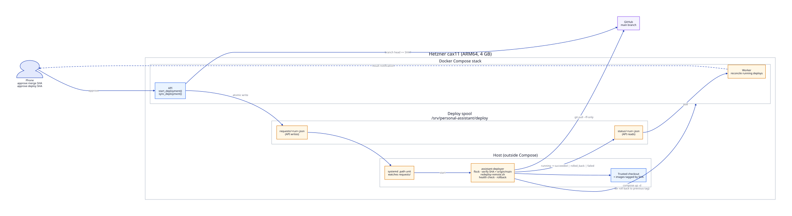

# Implementation Plan

This plan turns the [core model](assistant-core-model.md) into shipped changes. It
starts with deploying directly on the Hetzner server, so every later phase can go from
phone to production without leaving the assistant.

Each phase is one or a few PRs and leaves the system working.

| Phase | Outcome | Depends on |
|---|---|---|
| 0 | Deploy directly on the Hetzner server, with rollback | — |
| 1 | Work items exist; runs and chats link to them | — |
| 2 | Chats focus on work items; briefs stay current | 1 |
| 3 | Phone and web show work items, briefs, and a timeline | 1, 2 |
| 4 | Spaces, agent profiles, and tiered routing | 1 |
| 5 | First non-coding Space (Shopping) with T0 and T2 | 4 |
| 6 | Scheduler, routines, watches, push notifications | 1, 4 |

## Phase 0: Deploy directly on the Hetzner server



### Today

1. Exact-SHA merge approval.
2. Deploy approval.
3. The API dispatches `.github/workflows/deploy.yml` (`WorkflowService.start_deployment`
   in `app/workflows/service.py`).
4. GitHub Actions SSHes back into the server.
5. The server runs `scripts/redeploy-remote.sh`.

The server deploys itself through a round trip that needs a deploy SSH key stored in
GitHub, an open SSH route from GitHub's runners, and `Actions: write` on the token.

### Target

The server deploys itself, without any of those. The API can't just run
`docker compose up`, for two reasons: it would need the Docker socket (root on the host),
and it would restart itself mid-deploy. Instead, a small **host deployer** runs outside
Compose under systemd. It receives requests through a file spool.

### Changes

**Host deployer (new)**
- `scripts/host-deployer.sh`:
  - Takes an `flock` and processes `requests/*.json` one at a time.
  - Checks the requested SHA is a full 40-character SHA and equals `origin/main`.
  - Records the currently running SHA as `previous_sha`, then runs
    `ASSISTANT_DEPLOY_EXPECTED_SHA=<sha> ./scripts/redeploy-remote.sh`.
  - Writes `status/<run_id>.json` (`running`, `succeeded`, `rolled_back`, `failed`, stage,
    deployed SHA, previous SHA, last 80 log lines) atomically, using tmp + rename.
- `deploy/systemd/assistant-deployer.service` (oneshot, runs as the deploy user in the
  `docker` group) and `deploy/systemd/assistant-deployer.path` (`PathExistsGlob` on
  `requests/*.json`).
- `scripts/install-host-deployer.sh`: creates the spool directories with tight
  ownership (requests writable only by the API container UID), installs the units, and
  enables the path unit.

**Rollback**
- `compose.remote.yaml`: give `api`, `worker`, and `coding-worker` an
  `image: personal-assistant:${ASSISTANT_IMAGE_TAG}` next to `build:` so each release is
  tagged by SHA.
- `scripts/redeploy-remote.sh`:
  - Set `ASSISTANT_IMAGE_TAG` to the deployed SHA.
  - If the health check fails, run `up -d --no-build` with the previous tag and exit
    with a distinct code meaning "rolled back".
  - Prune images older than the last three tags.
- Migrations stay backward-compatible (already a stage in
  `workflows/assistant-deployment.yaml`), so the previous image runs against the new
  schema. The existing pre-deploy `pg_dump` remains the disaster path.

**API and worker**
- `app/deployments/host.py` (new), with a `HostDeployer` class:
  - `request(run_id, sha)` writes the request file.
  - `status(run_id)` reads the status file.
- `app/deployments/models.py`: use the existing, unused
  `DeploymentStrategy.COMPOSE_PULL_REDEPLOY` (rename the value to `host_deployer`). It
  doesn't need a `workflow_file`.
- `app/workflows/service.py`: branch `start_deployment` / `sync_deployment` on
  `target.strategy`.
  - Keep the GitHub branch-head check.
  - Map deployer states to workflow stages: `deploy` → `health_check` → `promote`, plus
    a `rolled_back` failure.
- `app/worker.py`: reconcile loop for `assistant-deployment` runs in `running` state,
  since the API restarts during its own deploy and nobody may be polling.
- Drain guard: `start_deployment` refuses while a coding run is `executing` on the
  same server. An explicit `force` input overrides this. In-flight runs already
  recover through checkpoints (`migrations/011`), but it's cleaner not to interrupt
  them.
- `compose.remote.yaml`: mount `requests/` read-write and `status/` read-only into
  `api` and `worker`.
- `deployment-targets/personal-assistant-production.yaml`: switch to `host_deployer`.
  Keep a disabled `personal-assistant-production-actions.yaml` as a fallback.

**Server hardening (one-time, from your laptop)**
- **Hetzner Cloud Firewall.** The project currently has none. Allow:
  - TCP 22 from your IP only,
  - TCP 80 and 443,
  - UDP 443.

  Docker publishes ports past `ufw`, so the cloud firewall is the reliable layer.
- **Swap.** The server is a cax11 (ARM64, 2 vCPU, 4 GB RAM, 40 GB disk). Add a 4 GB swap
  file so image builds don't OOM-kill the running stack.
- **SSH.** Use key-only SSH with password login disabled.
- **ARM64 images.** `postgres` and `caddy` are fine. Confirm each CLI in
  `Dockerfile.coding-worker` installs on arm64.
- **Clean up GitHub.** After the first host deploy succeeds, remove the
  `DEPLOY_SSH_PRIVATE_KEY` secret and drop `Actions: write` from the token.

**Bootstrap (once, over SSH)**

```bash
ssh <deploy-user>@<server>
cd /srv/personal-assistant/app   # the deployment checkout, owned by the deploy user
git pull --ff-only origin main
sudo ./scripts/install-host-deployer.sh # creates the spool the API mounts
./scripts/redeploy-remote.sh            # brings up the stack with the spool mounts
systemctl status assistant-deployer.path
```

Manual deploys stay available at any time with `./scripts/redeploy-remote.sh`.

### Tests
- `tests/test_deployments.py`: covers the `host_deployer` target validation, and
  checks that request/status files round-trip through a temp spool.
- Workflow service tests:
  - start refuses a non-head SHA;
  - status maps to stages;
  - `rolled_back` maps to failed;
  - a repeated sync is idempotent.
- Run `shellcheck` on the scripts.
- A dry-run mode for `host-deployer.sh` (`ASSISTANT_DEPLOYER_DRY_RUN=1`) skips Compose,
  so tests can exercise the flow in CI.

### Done when
A merged PR approved from the phone gets deployed by the server itself. The phone shows
`succeeded`. A deliberately broken `/health` produces `rolled_back`, with the previous
SHA serving.

## Phase 1: Work items data model

### Changes
- `migrations/013_work_items.sql`:
  - `spaces` (id, slug, name, kind).
  - `work_items` (id, space_id, kind `goal|list|routine|watch`, title, status, brief
    JSONB, checklist JSONB, links JSONB, timestamps, version).
  - `chat_work_items` (chat_session_id, work_item_id, focused_at).
  - `tasks.work_item_id`.
  - `task_events.work_item_id`, plus a `work_item_events` view or a nullable
    `task_id` for item-level events.
  - Seed a default `coding` Space per entry in `repositories/` and a `general` Space.
- Backfill: one work item per root task lineage (follow `parent_task_id` /
  `superseded_by_task_id`). The brief is seeded from `build_task_context`
  (`app/domain/task_context.py`).
- `app/persistence/models.py`: add the models.
- `app/work_items.py` (new): a `WorkItemService` for create/get/list/update brief and
  `link_run`, following the session and event patterns in `app/service.py`.
- `app/service.py`: `create_task` gets an optional `work_item_id`. New tasks from a
  chat attach to the chat's focused item.
- `app/api/routes.py`, `app/api/schemas.py`:
  - `GET/POST /work-items`
  - `GET/PATCH /work-items/{id}`
  - `GET /work-items/{id}/timeline`
  - `GET /timeline`

### Tests
`tests/test_work_items.py`:
- CRUD;
- the backfill on a lineage fixture;
- a task created in a focused chat links to the item.

Existing tests must pass unchanged.

## Phase 2: Chat focus, context builder, brief write-back

### Changes
- **Focus.**
  - `POST/DELETE /chat-sessions/{id}/focus/{work_item_id}`.
  - `#slug` mentions in a message resolve to focus.
  - "Make this a task" in the conversation's proposal flow (`app/domain/proposals.py`)
    creates a work item instead of a bare task.
- **Context builder.** Replace transcript-based context in
  `app/execution/conversation.py` with focused items' briefs, the last N events, and
  `MemoryService.relevant` (`app/memory.py`), within a token budget.
- **Write-back.** A worker job, `app/briefs.py`, updates the brief through the manager
  model client with a strict JSON schema, reusing the validated-adapter pattern in
  `app/manager/model/adapter.py`. It triggers when a chat has been idle for 10 minutes
  and when a run completes. Each update appends `BRIEF_UPDATED` with a diff.

### Tests
- A scripted model client produces brief updates.
- Malformed output leaves the brief unchanged and is audited.
- A context snapshot test for a focused chat.

## Phase 3: Clients

### Changes
**Android (`android-assistant/native/.../ui/`)**
- `TaskCenterScreen.kt` becomes the Work Items list, grouped by Space.
- New `WorkItemScreen.kt` shows the brief, checklist, runs, and timeline, with a
  "Discuss" action on each event.
- `ChatThreadScreen.kt` shows focus chips.
- `AssistantApi.kt` gets the new endpoints.

**Web (`app/web/index.html`):** the same three views.

### Done when
You can start a chat from the phone, make it a task, close the app, open a new chat
tomorrow, pick the item, and continue without re-explaining.

## Phase 4: Spaces, agent profiles, tiered routing

### Changes
- **Space packs.** A `spaces/<slug>/` directory holds `space.yaml`, `profiles/`,
  `skills/`, `tools.yaml` (MCP servers), and `workflows/`.
  - `app/spaces/registry.py` loads the packs and wraps the existing capability,
    runner, workflow, and deployment registries. The current top-level directories
    become the `coding` pack's contents (move them, or point to them).
- **Agent profile model.** Model, skills, tools, permissions, budget.
- **Tier.**
  - `TaskAnalysis` (`app/manager/model/contracts.py`) gains a `tier_hint`.
  - The deterministic policy (`app/manager/policy.py`) sets the final `tier`, choosing
    the lowest tier whose profile satisfies the requirements.
  - Record the tier on the run and in `MANAGER_DECISION_CREATED`.
- **Runtime state.** Extend `app/providers/state.py` outcome counts with cost and
  latency per profile, so routing can prefer cheaper profiles that succeed.

### Tests
Policy table tests (input analysis → tier/profile). Pack loading rejects unknown tools
and unsafe paths.

## Phase 5: First personal Space — Shopping

### Changes
- **T0 executor.** `app/execution/direct.py` handles add/remove/check list entries and
  save memory. It needs no model and is idempotent.
- **T2 tool agent.** `app/execution/tool_agent.py` is an MCP client loop limited to the
  profile's tools and budget. It emits `TOOL_CALLED` / `TOOL_RESULT_RECEIVED`, which
  already exist in `EventType`.
- **Shopping pack.**
  - A `list` work item for groceries.
  - A research profile with a web-search MCP.
  - Purchases are always gated by policy, never automatic.

### Done when
- "Add oat milk" goes through T0 in under a second.
- "Find a good rain jacket under €150" goes through T2 and produces a comparison in the
  item's brief.

## Phase 6: Scheduler and notifications

### Changes
- **Scheduler.** A `schedules` table (work_item_id, cron or due_at, next_run_at) and a
  scheduler loop in the worker that claims due rows with `FOR UPDATE SKIP LOCKED`,
  like the task queue does.
  - `routine` items start a run when due.
  - `watch` items run a check profile and notify on change.
- **Push.** Push notifications to Android (FCM) for:
  - approvals needed,
  - deploy results (Phase 0),
  - reminders and watch triggers.

## Order of work

Phase 0 first: it is small, and it makes every later PR deployable from the phone.
Then Phases 1 → 2 → 3, which together deliver the chat/task model you asked for.
Phases 4–6 open up the personal Spaces.

## Status

- **Phase 0 is done**: host deployer (#9), live on the server and used for approved
  deployments with automatic rollback.
- **Phases 1–2 are done**: work items, spaces, timeline and backfill (#20); #mentions,
  briefs in model prompts, and brief write-back (#21).
- **Phase 3 is done for the web console** (#22). The Android app (PR 4b) is next.
- **Hardening from the code review**: coding work only through approved workflows,
  stuck coding follow-ups, write-back off the task loop (#23); redeploy provider and
  backup retention (#24).

## Backlog

Agreed follow-ups, not yet scheduled. Highest value first.

- [ ] **Server-side triage.** One server decision per chat message (`answer`,
  `propose_coding`, `propose_task`, `clarify`) from a cheap model with a strict schema,
  repository inferred from manifest aliases, and keyword rules as the fallback. Clients
  render the decision instead of their own rules. Brief and logic in the conversation
  that produced #13–#18; the first assistant-run attempt was lost to an environment test
  failure (#16).
- [ ] **Escalation runner for repairs.** The repair pass (#18) reuses the runner that wrote
  the failing code. Add an `escalation` role to `coding-runners/*.yaml`: repairs (and
  later hard tasks) use a stronger model such as Claude Code on the Anthropic API or
  Codex, falling back to the next-ranked runner when none is configured. Needs an API
  key in `.env.remote` and an ARM64 check of the CLI.
- [ ] **Repository readiness in the console.** "(not configured)" is computed from the API
  container's environment, which never has repository mounts. The coding worker should
  report which repositories passed preflight, and the console should show ready or
  "coding worker offline".
- [ ] **Chat model hand-off.** Let the conversation model return a
  `propose_coding_workflow` action (like phone actions) instead of answering "I can't
  edit files", and stop claiming that when a coding worker is available.
- [ ] **Deploy approval in the Android app.** Propose, approve, and start deployments
  from the app, not only the web console (fits Phase 3).
- [ ] **Deploy any `main` head from the console.** A task's Deploy button only works while
  its merge is the tip of `main`; offer "deploy current main" when it is not.
